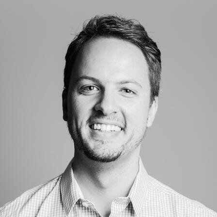

I'm a mobile developer, with more than 6 years experience on [iOS](https://www.apple.com/ios), and other Apple platforms ([macOS](https://www.apple.com/macos), [watchOS](https://www.apple.com/watchos), [tvOS](https://www.apple.com/tvos)).

I've attended [WWDC](https://developer.apple.com/wwdc/) in 2013 and 2016, attended Apple Watch workshops in London before its launch, and hosted the [Johannesburg CocoaHeads Meetup](https://www.meetup.com/CocoaHeads-Johannesburg/).

I live in South Africa, where I lead a diverse team of mobile developers on projects in the medical and financial sector.

Wanna talk? [I'd love to](mailto:website@wilmar.me)!